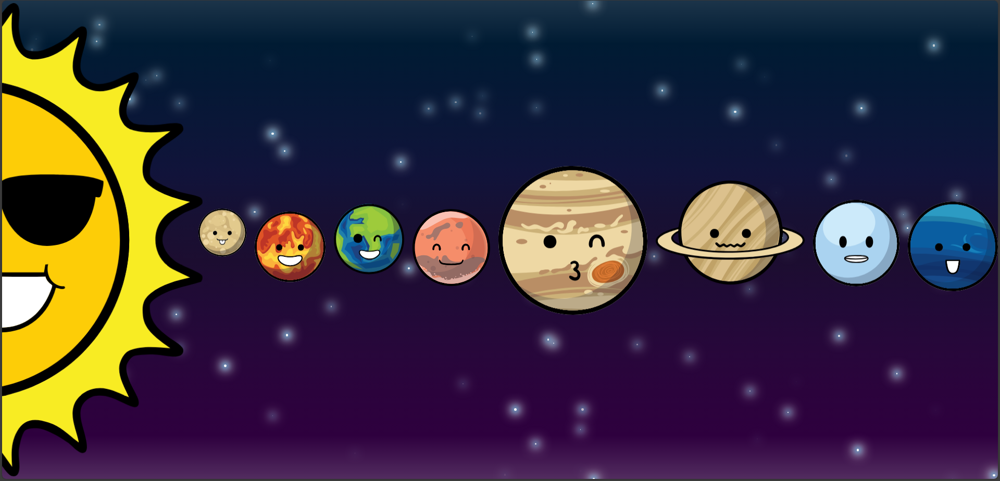
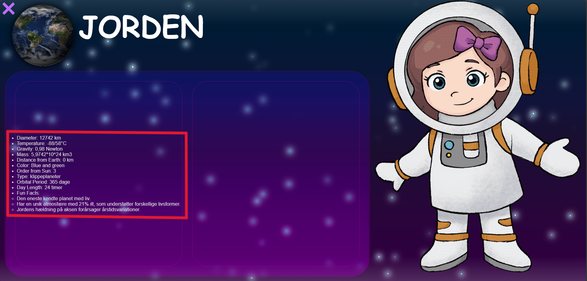

# Interaktiv-storytelling - Kom med Astra i rummet
<p align="center" style="margin-bottom: 0px !important;">
  
</p>
<h1 align="center" style="margin-top: 0px;">Material Bread</h1>

<p align="center" >Cross Platform React Native Material Design Components</p>

<div align="center" >

[](https://travis-ci.org/codypearce/material-bread) [](https://www.npmjs.com/package/material-bread)   [](https://codypearce.github.io/material-bread/)

</div>

<p align="center" style="margin-bottom: 0px !important;">
  
</p>

<p align="center" style="margin-bottom: 0px !important;">
  <h2 align="center" style="margin-top: 0px;">Choose a platform to get started</h2>
</p>

<p align="center" style="margin-bottom: 0px !important;">
  <a href="https://material-bread.org/getting-started/react-native">
    
  </a>
 <a href="https://material-bread.org/getting-started/web">
    
  </a>
  <a href="https://material-bread.org/getting-started/electron">
    
  </a>
   <a href="https://material-bread.org/getting-started/macos">
    
  </a>
  <a href="https://material-bread.org/getting-started/windows">
    
  </a>
  <a href="https://material-bread.org/getting-started/nextjs">
    
  </a>
  <a href="https://material-bread.org/getting-started/expo">
    
  </a>
  <a href="https://material-bread.org/getting-started/vue-native">
    
  </a>
  
</p>
<!-- <p> Find hende </p> [her](https://storytelling.mdamsgaard.dk/) <br>
Siden er tilpasset en skærmstørrelse på 1912 x 920 -->

## Sådan har vi brugt JSON



Med javascript henter vi vores JSON data ind i koden. Når en planet bliver valgt, gemmes den i parameteren **'planet'**.  


<pre><b>js/information.js</b> | Linje: 3-31 | <i>Koden er forkortet af hensyn til enkelthed</i> </</pre>

```Javascript
function info(planet) {
  fetch('./json/planet_facts.json')
    .then(response => response.json())
    .then(jsonData => {
      displayPlanetInfo(jsonData[planet], planet);
        selectedPlanet = planet;
    });
}
```
</pre>

**'planet'** bliver brugt til at at specificere <span style="color: #68cdfe">objekt KEY'en</span> i JSON filen 

<pre><b>json/planet_facts.json</b> | Linje: 72-99 </</pre>
```JSON
"jorden": {
  "name": "Jorden",
    "diameter": "12742 km",
    "temperature": "-88/58°C",
    "gravity": "0,98 Newton",
    "mass": "5,9742*10^24 km3",
    "distance_from_earth": "0 km",
    "farve": "Blå og grøn",
    "color": "Blue and green",
    "order_from_sun": 3,
    "type": "klippeplaneter",
    "orbital_period": "365 dage",
    "day_length": "24 timer",
    "img": "/img/earth_map.png",
    "img2": "/img/earth_clouds.png",
    "fun_facts": [
      "Den eneste kendte planet med liv.",
      "Har en unik atmosfære med 21% ilt, som understøtter forskellige livsformer.",
      "Jordens hældning på aksen forårsager årstidsvariationer."
    ],
    "short_facts": [
      "Jorden.", 
      "Vores planet.", 
      "Årsagen til, at vi har forskellige årstider, er, at vores akse hælder en smule til siden.", 
      "Vi er også den eneste planet i universet, hvor mennesker har kendskab til liv."
    ],
    "audio_duration" : 12
  },
```
</pre>

<span style="color: #68cdfe">Objekt KEY'en</span> i dette tilfælde er jorden. Under den har vi faktaerne omkring planeten, som bliver lagt ind på "planet-siden". 



På billedet ovenover ses, hvordan JSON dataen ser ud når den bliver implementeret raw med følgende javascript kode. 

<pre><b>js/information.js</b> | linje: 33-70 | <i>Koden er forkortet af hensyn til enkelthed</i> </</pre>
```javascript
function displayPlanetInfo(data, planetName) {
  facta.innerHTML = `
    <ul>
      <li>Diameter: ${data.diameter}</li>
      <li>Temperature: ${data.temperature}</li>
      <li>Gravity: ${data.gravity}</li>
      <li>Mass: ${data.mass}</li>
      <li>Distance from Earth: ${data.distance_from_earth}</li>
      <li>Color: ${data.color}</li>
      <li>Order from Sun: ${data.order_from_sun}</li>
      <li>Type: ${data.type}</li>
      <li>Orbital Period: ${data.orbital_period}</li>
      <li>Day Length: ${data.day_length}</li>
      <li>Fun Facts:</li>
      <ul>
      ${data.fun_facts.map(fact => `<li>${fact}</li>`).join('')}
      </ul>
    </ul>
  `;
}
```
</pre>

I hvert <span style="color: #68cdfe"> objekt KEY</span> findes to <span style="color: #68cdfe">array KEYs</span>; **'fun_fact'** og **'short_facts'**. <br>
Array'et **'short_facts'** bruges sammen med **'audio_duration'** til at beregne hvor lang tid, hvert item skal vises i taleboblen.

<pre><b>js/voices.js</b> | linje: 13-44 | <i>Koden er forkortet af hensyn til enkelthed</i> </</pre>
```javascript
let undertekster = jsonData[selectedPlanet].short_facts;
let audioDuration = jsonData[selectedPlanet].audio_duration;

function displayFacts(index) {
    if (index < undertekster.length) {

        taleBoble.innerHTML = `<p>${undertekster[index]}</p>`;
        const wordCount = undertekster[index].split(" ").length;
        const displayTimePerWord = 350;
        const totalDisplayTime = audioDuration * 1000;
        const timeForCurrentFact = (wordCount * displayTimePerWord / totalDisplayTime) * totalDisplayTime;

        setTimeout(() => {
            mund.src = "/img/talking-still.png";
            taleBoble.innerHTML = "";

            displayFacts(index + 1);
        }, timeForCurrentFact);
    }
}
```
</pre>


<!-- keys bliver brugt til forskellige ting 
img bliver brugt
audio duration bliver også brugt med beregninger i forbindelse med
short facts som bliver hakket op -->